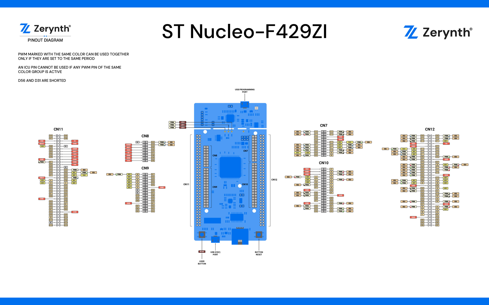

# Clase 1
## Hoja 1

* Example 1-1

## Hoja 2
1. GitHub es una plataforma de desarrollo que permite colaborar para la construcción de Software utilizando como base el sistema de control de versiones Git. 

2. Example 1-1

3. Example 1-2

4. 

6. La principal diferencia entre esta placa y el Arduino UNO utilizado en Labo de micros, es que su procesador es de 32 bits, contra los 8 del Arduino. Además el procesador tiene un reloj mucho más rapido (180 MHz contra 16 MHz). Posee mayor cantidad de memoria RAM y de memoria Flash. Además de poseer una cantidad mayor de pines de entrada y salida.

Por otro lado, ambos son programables en C++, aunque Arduino trabaja con una versión reducida y adaptada del mismo, lo cual limita mucho las funcionalidades. Comparandolo con el caso de Labo de Micros, donde se usó Assembly para programar el Arduino, el salto a C o C++ es muy notorio.

Por el contrario, el Arduino UNO posee la ventaja de ser de mucho menor tamaño, por lo que es conveniente para ser utilizado en ciertas aplicaciones donde esto sea importante. Además de ser mucho más barato.

## Hoja 3

1. La libreria `arm_book_lib.h` contiene definiciones de estados, tanto eléctricos (HIGH y LOW) como funcionales (ON y OFF).

2. La libreria `mbed.h` contiene includes de funciones que están en otros archivos, como ser drivers y platforms. Es el archivo que linkea con el sistema operativo mbed-os, que es el que contiene todas las funcionalidades de la placa dadas por ARM.

4. OpenSTM32 es un sitio web donde la comunidad que trabaja con STM32 ofrece ayuda e información acerca de la placa y su programación. 

5. Mbed OS es el sistema operativo diseñado para correr en placas ARM y ser utilizado para IOT. Incluye todas las funcionalidades que se necesitan para desarrollar productos con microcontroladores ARM Cortex-M. Incluyendo seguridad, conectividad, drivers sensores y otros dispositivos.